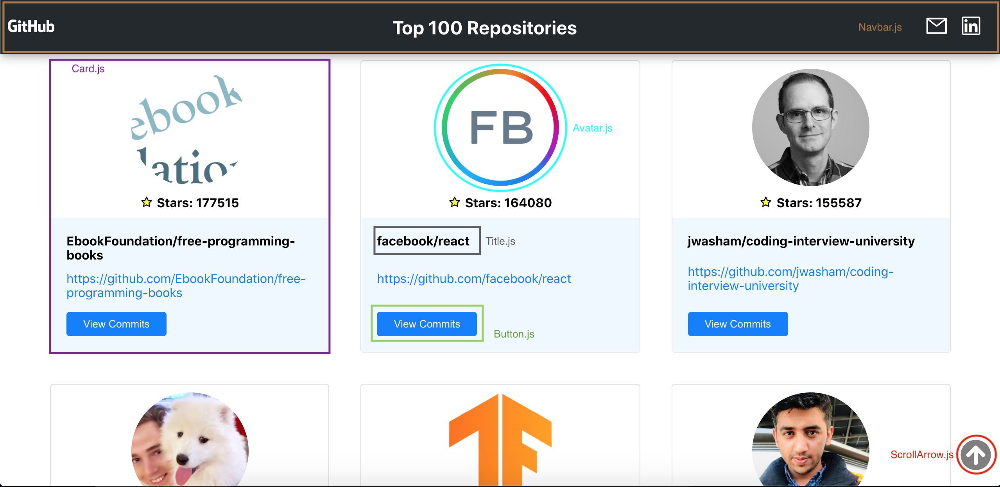
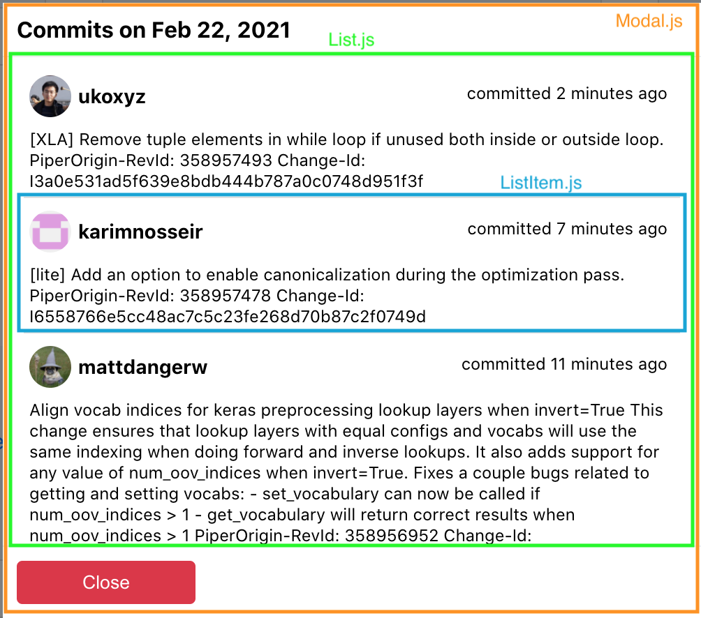
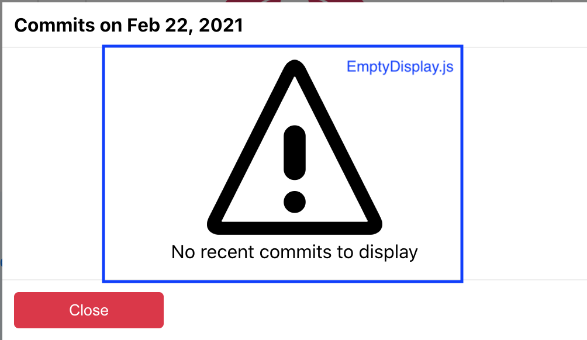
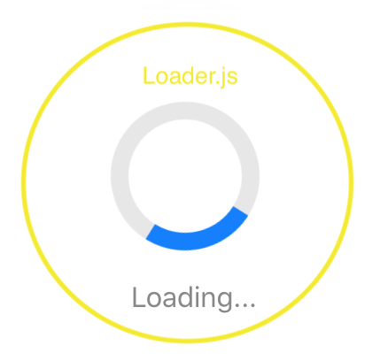

## Getting Started

This project is a single page application that displays a list of the 100 most starred repositories on github.
Additionally, upon the click of a button, the application displays commits made in the last 24 hours for the corresponding repository.

## Setup Instructions and Commands

In your terminal, navigate to the github-repos-ui directory, and from the root folder run:

- `npm install` - installs all project dependencies.

- `npm start` - Runs the app in the development mode. Open [http://localhost:3000](http://localhost:3000) to view it in the browser.
  the page will reload if you make edits and show errors in the console if there are any.

### Additional Commands

- `npm test` - launches the test runner in interactive watch mode. To run all the tests, press `a` on your keyboard.

## Technologies Used

For this UI project, [Create React App](https://github.com/facebook/create-react-app) was used to get started on development right away.
Another useful feature was that a testing framework ([Jest](https://jestjs.io/)) is included as well.
I used snapshot testing in addition to [Enzyme](https://enzymejs.github.io/enzyme/) to test the output of the components thoroughly.
The advantage with snapshot tests is that it's a good way to keep track of a component's characteristics (given a specific input),
while also asserting correctness during future development of those components.

For styling, I decided to use SCSS. Mainly because of variable usage and nested styling class declarations.
One simple advantage to that is being able to establish your styles in the same hierarchy as the components are in your component files.

## Component Design and Functionality

Below you'll find some screenshots that highlight the main components used to build the application. For the most part, I tried to make the components as abstract as possible.

### Main Repo Screen

This is the main application view that displays repository cards in addition to the navbar and scroll arrow.
The user can press the scroll arrow to move them back to the top of the repository list after scrolling down.
On the Card component, you'll see the title, star count, avatar photo, and url of the repository.

### Modal

To display the list of commits made in the last 24 hours, I decided to use a modal. The modal is triggered via the [View Commits] button on the Card component.
You can close the modal in two different ways. First, by pressing the [Close] button, and second, by clicking anywhere outside of the modal.

### Empty Display

If the modal is triggered for a given repository and there is no data to display (since no commits were made in the past 24 hours), the user will see an empty display component.

### Loading Display

On the application's initial boot up and while fetching commits, the user will be presented with a Loading indicator. This provides feedback to the user to let them know that some external data processing is occurring.

## Additional Notes

- To inform the user that the commits displayed are only commits made within the past 24 hours, I included a message in the form of a `title` attribute on the [View Commits] button.
- No component libraries are used in this project.
- [Moment](https://momentjs.com/) is used for some of the date functionality.
- I used some icons from [react-icons](https://react-icons.github.io/react-icons) for random areas of the application. For example, in the Navbar component.
- The application is mobile friendly.
